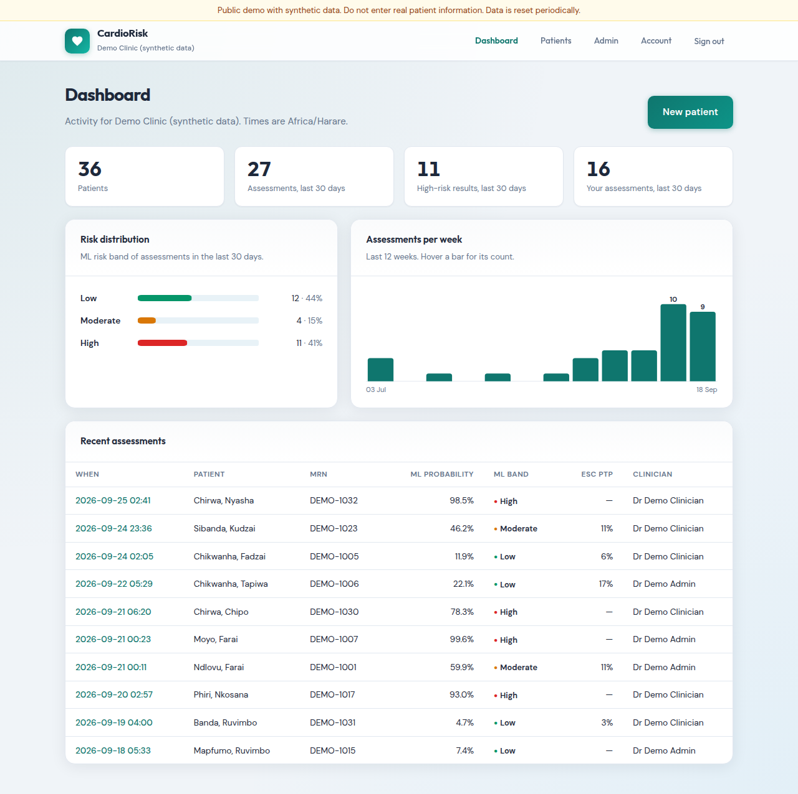
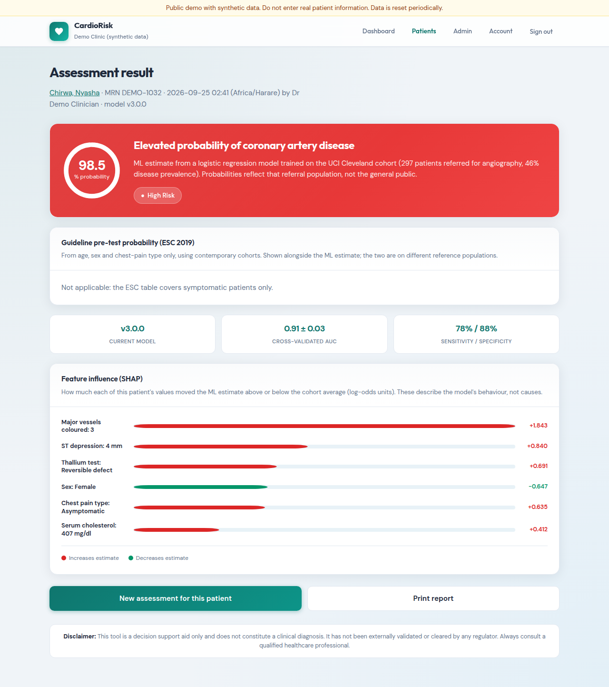
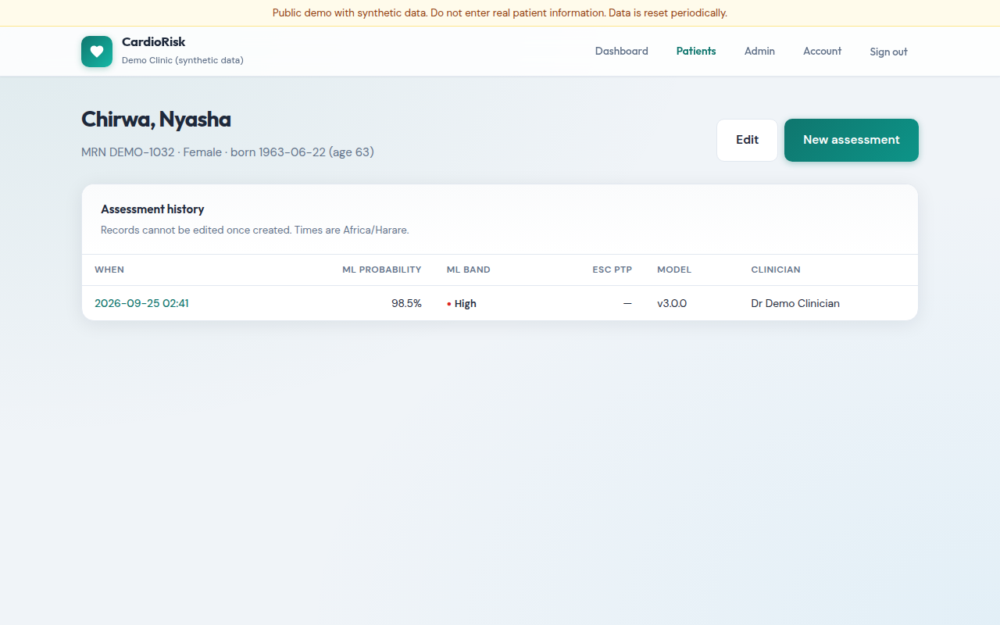
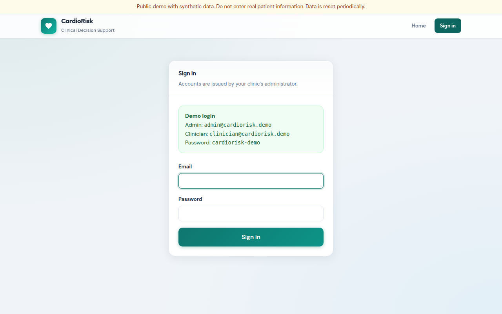
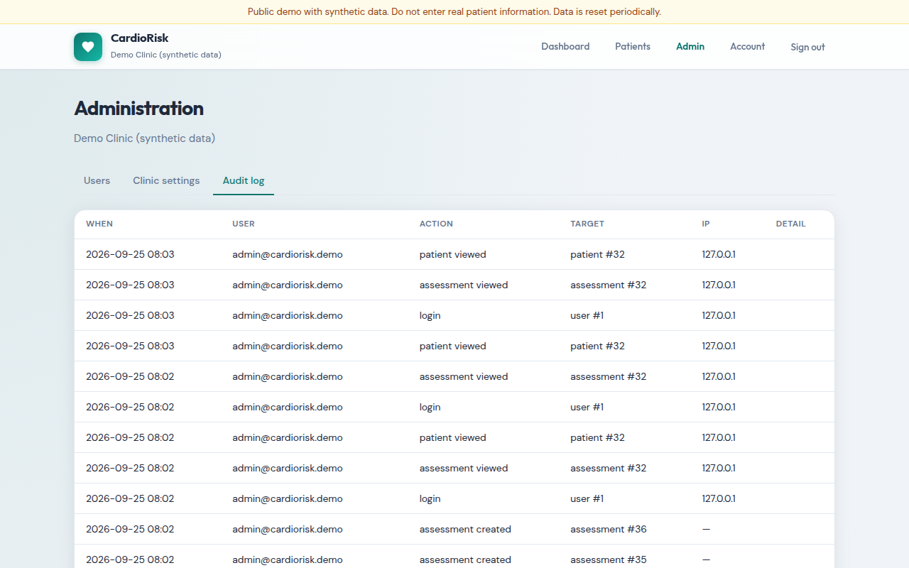
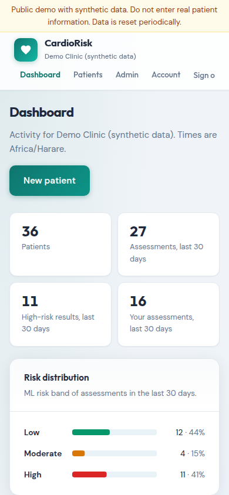

# CardioRisk

[](https://github.com/ano-tha-vibecoder/CardioRisk/actions/workflows/ci.yml)

A multi-clinic web app for cardiovascular risk assessment. Clinicians keep
patient records and run assessments. Each assessment shows an explainable ML
estimate next to a published guideline score, and is saved to the patient's
history with an audit trail.

Built as a portfolio project, with a Zimbabwe / Southern Africa deployment
context in mind. **Not a medical device. The public demo uses synthetic data
only.**



| Assessment | Patient record |
|---|---|
|  |  |

| Sign-in (demo mode) | Audit log | Mobile |
|---|---|---|
|  |  |  |

## Features

- **Clinics as tenants.** Patients, assessments, users and audit events all
  belong to one clinic. Every query goes through a single scoping helper, and
  tests check that another clinic's ids return 404.
- **Accounts.** Admin and clinician roles, scrypt password hashes, account
  lockout, TOTP two-factor that an admin can require clinic-wide, forced
  change of admin-issued temporary passwords, idle and absolute session
  timeouts, and sessions invalidated on password change or deactivation.
- **Patients and assessments.** Search by name or MRN. Assessments are
  immutable and store the inputs, model version, result and explanation.
  Age and sex come from the patient record.
- **Explainable ML.** Logistic regression with exact per-variable SHAP
  contributions.
- **Guideline score alongside ML.** ESC 2019 pre-test probability, with a
  heuristic flag when the two clearly disagree.
- **Dashboard.** Summary tiles, 30-day risk distribution, weekly volume,
  recent assessments.
- **Admin.** User management, clinic settings (time zone, required 2FA),
  audit log.
- **Operations.** Alembic migrations, Postgres in production, a health
  check, CI on SQLite and Postgres, a one-click Render blueprint, and a
  public demo mode.

## Design decisions

**The advertised accuracy was wrong, so I measured it properly.** The
original notebook reported AUC 0.963 from a single 60-patient test split.
Repeated stratified 5-fold cross-validation (×10) of the *whole* pipeline
gives **0.91 ± 0.03**. SMOTE was removed because the classes are 54/46: it
added nothing and distorted the probabilities. Recursive feature selection
was removed because it did not improve AUC and dropped age and cholesterol,
two inputs the form still asked for.

**SHAP without the `shap` library.** For a linear model, interventional SHAP
values are exactly `coef × (x − E[x])`. Computing them directly removed a
heavy dependency (`shap` pulls in `numba`/`llvmlite`) and fixed a subtle
issue: `shap.LinearExplainer` silently subsamples the background to 100 rows.
A test checks the closed form against `shap` with the full background.
One-hot columns are summed back into their clinical variable, which is exact
because SHAP values are additive. That fixed explanations like "Asymptomatic
−0.68" being shown for a patient with *atypical* angina.

**Tenant isolation is enforced in one place.** Views never query a clinical
table directly; they call `scoped(Model)` or `get_scoped_or_404`. A 404
(not 403) avoids confirming that another clinic's record exists.

**The audit log never holds clinical values.** An edit records *which* fields
changed, not their old or new values, so the log can be retained and exported
without becoming a second copy of patient data.

**Assessments are immutable and use post/redirect/get.** A refresh cannot
create a duplicate, and a historical record always shows exactly what the
clinician saw, including the model version.

**No third-party requests.** Fonts are self-hosted (SIL OFL). The CSP is
`'self'` only, with no inline script or style, and a test fails if a template
references an external URL. This keeps patient pages private and fast on
slow connections.

**A shared demo account needs different rules.** In `DEMO_MODE`, visitors
share the demo accounts, so password, 2FA, user and settings changes are
blocked, and failed logins do not lock accounts. Otherwise one visitor could
lock everyone else out.

**Rejecting a convenient but wrong dependency.** For the planned WHO 2019
score, I reviewed a CRAN package claiming to implement it and did not use it.
Its recalibration counts age twice and ignores the published baseline
survival. The WHO score will be built from the official WHO regional charts
instead.

## The model and its limits

| | |
|---|---|
| Data | UCI Cleveland heart disease, 297 complete cases, 46% prevalence |
| Target | >50% diameter narrowing on coronary angiography |
| Model | L2-regularised logistic regression, 19 encoded features |
| Evaluation | Repeated stratified 5-fold CV × 10 of the full pipeline |
| Performance | AUC 0.91 ± 0.03 · sensitivity 78% · specificity 88% (threshold 0.5) |

- **Wrong population for the target market.** These were 1980s US patients
  already referred for angiography. The probabilities will not carry over to
  Southern African primary care.
- **Specialist inputs.** `ca` (fluoroscopy) and `thal` (thallium imaging) are
  rarely available outside referral centres, so this model can only ever be
  a specialist module.
- **The guideline table is European.** The ESC 2019 table (replaced in the
  2024 ESC guideline) comes from European cohorts. Its values are pinned in
  tests and should be checked against the source.

**Planned:** make the WHO 2019 non-laboratory CVD risk chart for Southern
sub-Saharan Africa the main score. It uses age, sex, smoking, blood pressure
and BMI, and predicts heart attack *and* stroke. The Cleveland model stays as
an optional specialist section. This is waiting on the official WHO chart
PDFs being added to the repo for scripted extraction.

## Run locally

```bash
python -m venv .venv && . .venv/bin/activate
pip install -r requirements-dev.txt
export FLASK_APP=app DEMO_MODE=1
flask db upgrade          # SQLite in instance/
flask seed-demo           # synthetic clinic, 36 patients, 12 weeks of history
flask run                 # sign in with the demo credentials shown on /login
pytest                    # 79 tests; TEST_DATABASE_URL=postgresql+psycopg://... for Postgres
```

For a real clinic, leave `DEMO_MODE` unset and onboard it with
`flask create-org "Clinic name" --admin-email ... --admin-name ...`. This
prints a one-time temporary password. To retrain the model
(deterministic): `python train.py`.

## Deploy

**Render (free tier):** New → Blueprint → select this repo. `render.yaml`
creates the web service and a Postgres database, generates `SECRET_KEY` and
`DEMO_PASSWORD`, then runs migrations and seeds the demo on start-up. Check
Render's current free-tier limits: services sleep when idle, and free
databases have historically expired after a fixed period.

**Anywhere else:** `Procfile` (release: migrations; web: gunicorn).

| Variable | Purpose |
|---|---|
| `APP_ENV=production` | Secure cookies, trusts one proxy hop, requires the two below |
| `SECRET_KEY` | Signs session and CSRF cookies |
| `DATABASE_URL` | Postgres (`postgres://` and `postgresql://` are both accepted) |
| `DEMO_MODE=1`, `DEMO_PASSWORD` | Public demo behaviour (see above) |
| `SESSION_IDLE_MINUTES`, `SESSION_ABSOLUTE_HOURS` | Defaults 30 and 12 |

## Beyond a portfolio

Holding real patient data would need more than code. In Zimbabwe that means
the Cyber and Data Protection Act (licensing with POTRAZ, a data protection
officer, rules on sending data abroad) and a conversation with MCAZ about
whether this counts as a medical device. Missing features include per-IP
rate limiting, SSO, data export and deletion, retention policy, encrypted
TOTP secrets, and monitoring.

## Layout

```
app.py                  WSGI entry point
cardiorisk/
  __init__.py           App factory, error pages
  models.py             Organization, User, Patient, Assessment, AuditEvent
  tenancy.py            Org-scoped queries, admin guard
  security.py           Session policy, demo restrictions, security headers
  auth.py               Sign-in, 2FA, password change
  main.py / patients.py / admin.py   Views
  ml.py                 Model loading, prediction, SHAP
  scores.py             ESC 2019 pre-test probability
  validation.py         Clinical input limits
  demo.py, cli.py       Demo seeding, create-org
  timezones.py, audit.py, config.py
preprocessing.py        Shared feature encoding (pickled with the model)
train.py                Cross-validated evaluation + production fit
migrations/             Alembic
.github/workflows/ci.yml, render.yaml, Procfile
```
